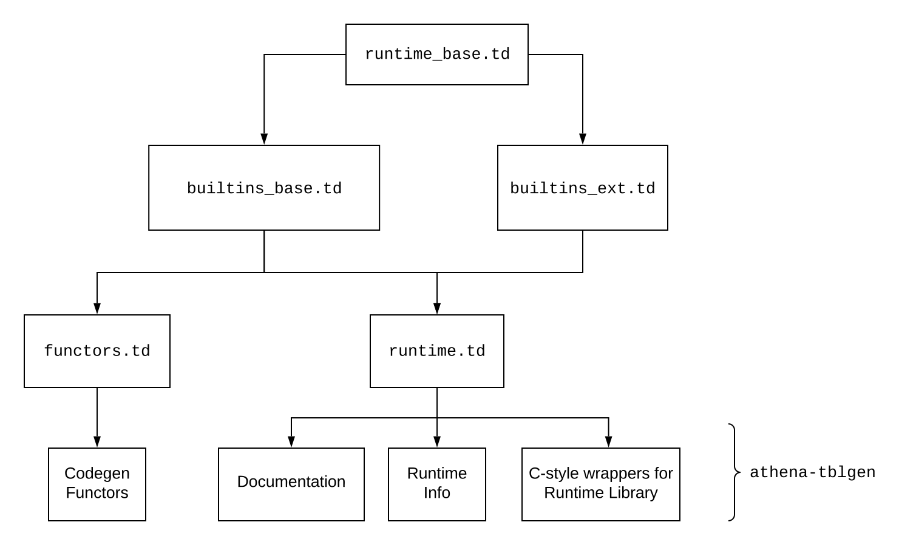

# LLVM Backend: Builtins

## Design Overview

A builtin is a routine provided by the runtime that users can use to perform
simple actions on tensors. For example, matrix-matrix multiplication, vector
sum. There are two groups of builtins in LLVM backend: standard and extended.
The standard builtins are those that are required by Athena for all runtimes.
Those are available for all data types supported by the runtime. The extended
builtins can probide additional functionality, but they are not required for
the Athena to operate correctly. Such builtins can provide fused operations,
less precise operations, or alternative operations. They are guaranteed not to
be called by the GraphCompiler, however, optimization passes can generate them
in order to provide better experience with Athena.

From developer's point of view builtins are functions with a template that
take certain kinds of arguments. To avoid code duplications, current
implementation makes use of code generation. Both C-style wrappers and codegen
functors are generated form a [TableGen](https://llvm.org/docs/TableGen/) file.
The following diagram can help understand relations between different files.

### Builtin requirements

* Builtins are required to take `Device*` and `Allocator*` as their first two
  arguments. The rest of arguments are arbitrary and can include tensors or
  pointers to structures.
* Although Athena manages memory, the builtins are required to explicitly lock
  and release tensors and specify data access type. It can be either read or 
  write.

## Athena TableGen Backend

To support different kinds of code generation for builtins, a special TableGen
backend is maintained.

### Command-line options

* `--help` Shows help and exits.
* `--emit-markdown-docs` Prints documentation for the builtins and the runtime
   to the Markdown file.
* `--emit-wrapper` Generates C-style wrappers for the builtins.
* `--emit-codegen` Generates functors for codegen.

### TableGen Syntax

> Note: this document only covers project's specifics. For TableGen manual see
> https://llvm.org/docs/TableGen/LangRef.html

#### Types

* `half` is an IEEE754 16-bit floating-point type.
* `float` is an IEEE754 32-bit floating-point type.
* `double` is an IEEE754 64-bit floating-point type.
* `void` is a C-style void type.
* `tensor` is any Athena tensor.

#### `class Runtime`

A base class that stores description of a single runtime.

* `name` is the runtime name.
* `version` is the runtime version.
* `summary` is a short description of the runtime.
* `description` is an extensive documentation for different runtime usages and
   potential pitfalls.
* `supportedTypes` is a list of types this runtime can operate on.
* `extraModules` is a list of files this runtime provides for the runtime driver
   to load.
* `extraFeatures` is a list of supported runtime extensions.

#### `class RT_Builtin`

A base class for any runtime builtin.

* `summary` is a short description of builtin.
* `desription` is an extensive description of builtin.
* `arguments` is a dag of arguments for this builtin. The required arguments
  (`Device*` and `Allocator*`) are not listed here.
* `builtinName` is a name of actual C++ function that performs the operation.
* `overloadTypes` is a list of types this builtin can operate on.

## Adding a new builtin

> Note: this guide is for Athena developers working on new standard builtins.
> User-defined builtins are not covered here.

Athena-defined builtins for the LLVM backend runtimes are stored in
`src/backend/llvm/runtimes/`.

### Step 1. Create builtin implementation

Define a new C++ function that does what needs to be done. Use templates to
make it data-type agnostic. Provide all necessary template specializations. If
this is a standard builtin (rather than an extended), make sure all runtimes
support it.

### Step 2. Register the builtin

Go to the corresponding TableGen file and add builtin description. Use other
builtins as a reference.

### Step 3. Write tests

Make sure to cover new builtin with tests. Athena provides some tools to make
it easier to test across different runtimes. See other tests for reference.
