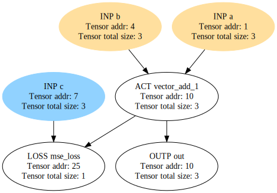

# Intro
Backpropagation is a family of algorithms used to efficiently train
neural networks. It exploits chain rule to calculate weight update.
Athena implements a generalized solution to apply different flavors of this method.

# Architecture

LLVM Executor will automatically generate gradient for given Graph,
propagate errors and apply updates to weights. Consider the following
graph as an example.

The blue input node is "frozen". It means its content will not be
updated during the process of backpropagation. The yellow input
nodes will be updated, however. The following steps will be applied
to the graph:

1. For `mse_loss` node derivatives of requested order is generated
2. For `mse_loss` node error is equal to its derivative
3. For `vector_add_1` node derivatives of requested order is generated
4. For `vector_add_1` node error is calculated. For Gradient Descent
algorithm error is defined as $derivative \odot \sum{errors from incoming nodes}$,
where $\odot$ is Hadamard product.
5. For `b` and `a` nodes generated error is applied. For Gradient
Descent updated value is calculated as `value += alpha*error`.
